# 🏗️ Construction Management

## 📌 Opis projektu

**Construction Management** to system zarządzania projektami budowlanymi, umożliwiający tworzenie, organizację i monitorowanie projektów, zadań zespołów oraz budżetów. Ułatwia komunikację między pracownikami i klientami oraz wspomaga cały cykl projektowy.

---

## 🎯 Cel

Stworzenie kompleksowego narzędzia dla firm budowlanych, które chcą efektywnie zarządzać projektami, zespołami, budżetami, dokumentacją oraz narzędzia umożliwiającego efektywne planowanie i komunikację między zespołami, a klientem – wszystko w jednym miejscu.

---

## 🛠️ Technologie

- **Język:** C# 12.0  
- **Środowisko:** .NET 8.0  
- **IDE:** Visual Studio Code & Visual Studio 2022  
- **ORM:** Entity Framework Core

---

## 🗂️ Struktura katalogów

```
App/
├── Controllers/      → Logika kontrolerów
├── Database/         → Kontekst bazy danych
├── Delegates/        → Delegaty aplikacji
├── Enums/            → Typy wyliczeniowe (np. role)
├── Events/           → Obsługa zdarzeń
├── Interfaces/       → Interfejsy aplikacji
├── Models/           → Modele danych
├── Repositories/     → Operacje na danych
├── Services/         → Logika biznesowa, autoryzacja
├── Utilities/        → Hashowanie, subskrypcje zdarzeń
└── Views/            → Prezentacja danych (UI)
```

---

## 🚀 Instrukcja uruchomienia

1. Zainstaluj .NET 8.0 SDK  
2. Sklonuj repozytorium  
3. Otwórz projekt w Visual Studio  
4. Przygotuj bazę danych (`Update-Database`)  
5. Uruchom projekt (`F5`)

[Instrukcja krok po kroku](https://github.com/cool-white-leaders-gang/ConstructionManagementApp/blob/main/README.md)

---

## 🧩 Funkcjonalności

### 🔨 Zarządzanie projektami
- Tworzenie/edycja/usuwanie projektów
- Przypisywanie zespołów i budżetów do projektów
- Monitorowanie postępu

### ✅ Zadania
- CRUD na zadaniach w ramach projektów
- Priorytety, statusy
- Przypisywanie użytkowników
- Wyświetlanie listy zadań przypisanych do użytkownika lub projektu

### 👤 Użytkownicy i role
- Obsługa sesji użytkowników
- RBAC (Role-Based Access Control)
- Logowanie
- Przypisywanie ról (menedżer, pracownik)

### 💰 Budżet
- Tworzenie i edycja budżetów
- Monitorowanie wydatków

### 📜 Logi
- Rejestracja akcji użytkowników

---

## 🧑‍💻 Interfejs użytkownika

- Logowanie

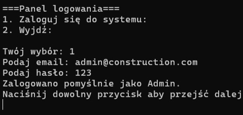
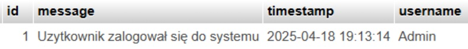

```Log po zalogowaniu```
- Główne menu

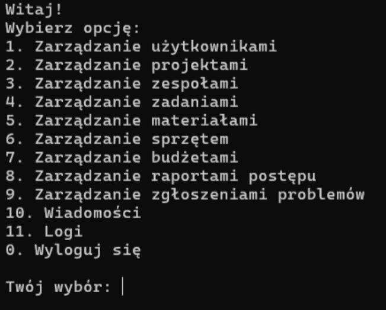

- Ekran zarządzania 


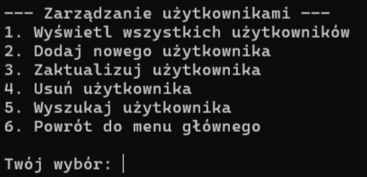
- Wypisywanie tabeli
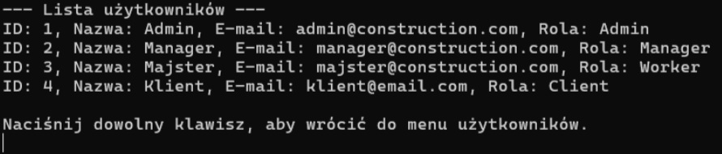

- Dodawanie do tabeli
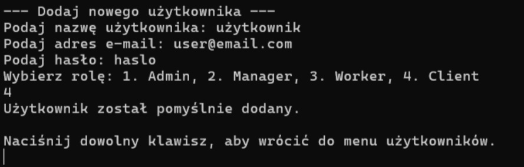

```użytkownik dodany do bazy```

							
	
<br>
```Log po dodaniu```

- Aktualizacja tabeli
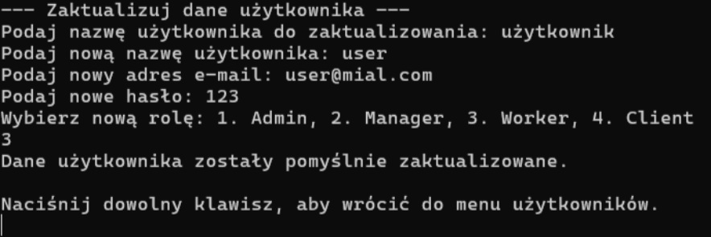
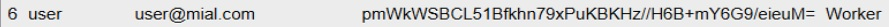
```użytkownik zaktualizowany w bazie```

							
	
<br>
```Log po aktualizacji```

- Usuwanie z tabeli
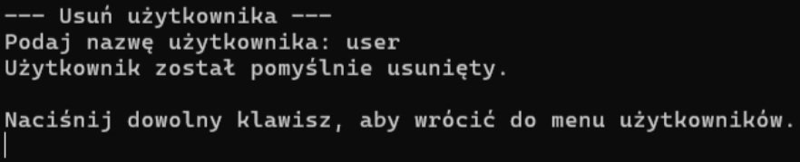
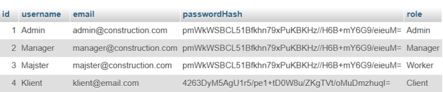
```użytkownik usuniety z bazy```

							
	
<br>
```Log po usunieciu```


- Przykładowy ekran po wpisaniu danych niezgodnych z logiką aplikacji (zespołami może zarządzać użytkownik, który ma rolę managera) 
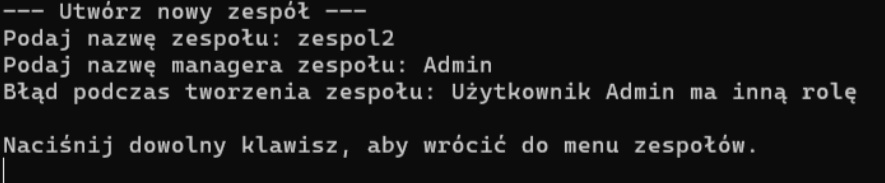

- Przykładowy ekran po wpisaniu nieprawidłowych lub nieistniejacyh danych 
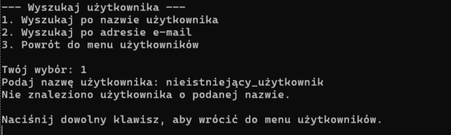


---

## 💡 Obsługa aplikacji

Menu sterowane liczbami – wpisz numer opcji i wciśnij `Enter`. Aplikacja prowadzi użytkownika przez kolejne kroki.

---

## 🧱 Architektura

### 🧠 AppDbContext
- Reprezentuje bazę danych
- Zawiera DbSety i konfigurację modelu

### 🔐 AuthenticationService
- Logowanie, sesje, bieżący użytkownik

### 📖 LogService
- Rejestrowanie działań użytkownika

### 🛡️ RBACService
- Uprawnienia i role
- Sprawdzanie dostępu do projektów i funkcji

### 📺 Widoki (Views)
- Wyświetlanie danych, formularze, menu

### 🗄️ Repozytoria
- CRUD na bazie danych
- Szukanie po ID i nazwie

### 🧮 Kontrolery
- Walidacja danych
- Obsługa błędów

### 🧬 Modele
- Reprezentacja tabel bazy danych
- Konstruktor + `ToString()`

---

## 🧯 Obsługa błędów

- `KeyNotFoundException` – brak obiektu
- `UnauthorizedAccessException` – brak uprawnień
- `InvalidOperationException` – brak projektów lub połączenia
- `ArgumentNullException` – nieprawidłowe argumenty
- `ArgumentException` – błędny format danych

---

## 🔍 Problemy i ograniczenia

- ✏️ Aktualizacja wymaga podania wszystkich danych (nie tylko np. e-maila)
- 🧭 Można pogubić się w strukturze kodu

---

## 🌱 Plany rozwoju

- Lepszy interfejs graficzny
- Przeniesienie bazy na zdalny serwer

---

## 👨‍💻 Autorzy

- **Filip Lubka** – [GitHub](https://github.com/lubkaf)
- **Patryk Stafecki** – [GitHub](https://github.com/stafecki)

---

## 📜 Szczegółowa dokumentacja

-[link do dokumentacji](https://github.com/cool-white-leaders-gang/ConstructionManagementApp/blob/main/documents/Construction_management_documentation.docx.docx) **(Nie odpala się na GitHubie)**